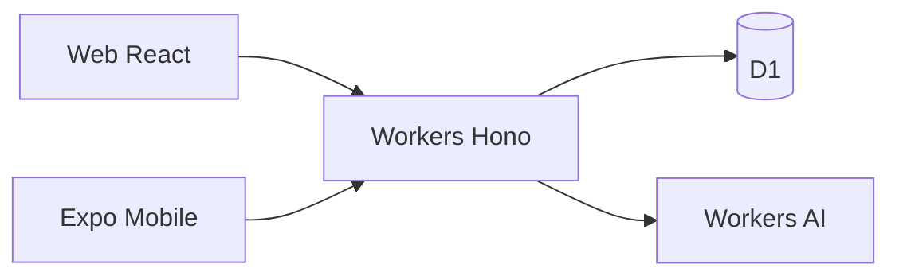

# LarderMind

**LarderMind** is a meal-planning app: pantry, recipes, meal plan, shopping list, and AI cooking help.

## Git layout (three remotes)

| Remote | Folder | Owns |
|--------|--------|------|
| **lardermind-backend** | this root | `docs/`, `tasks/`, `AGENTS.md`, `.cursor/rules/`, `backend-cf/` |
| **lardermind-frontend** | `frontend/` | Web (Vite) — own git remote |
| **lardermind-mobile** | `mobile/` | Expo — own git remote |

API is **Cloudflare Workers** only (`backend-cf/`). Nest / `backend-node` and the static `landing/` page have been removed.

**Hosting:** Cloudflare Pages (web) + Workers + D1. See [docs/architecture/cloudflare-target.md](./docs/architecture/cloudflare-target.md).

---

## Start here

| If you want to… | Read this |
|-----------------|-----------|
| Dev workflow (feature / bug) | [docs/workflow/README.md](./docs/workflow/README.md) · [AGENTS.md](./AGENTS.md) |
| Cloudflare API | [backend-cf/README.md](./backend-cf/README.md) · [docs/features/backend-cf-api.md](./docs/features/backend-cf-api.md) |
| Cloudflare Pages (web) | [docs/features/frontend-cf-pages.md](./docs/features/frontend-cf-pages.md) · CI in **lardermind-frontend** |
| Project status | [PROJECT_STATUS.md](./PROJECT_STATUS.md) |
| Store launch checklist | [docs/store-launch-todo.md](./docs/store-launch-todo.md) |

---

## Repo map

```
LarderMind/                    ← remote: lardermind-backend
├── backend-cf/                Cloudflare Workers + D1 + Workers AI
├── docs/                      Architecture, features, workflow
├── tasks/                     Task trackers
├── AGENTS.md                  Agent entrypoint
├── .cursor/rules/             Cursor workflow rules
├── .github/workflows/         backend-cf CI deploy
├── frontend/                  ← remote: lardermind-frontend (ignored by root git)
└── mobile/                    ← remote: lardermind-mobile (ignored by root git)
```

---

## Quick run

### API (`backend-cf`, port 8787)

```powershell
cd backend-cf
npm install --legacy-peer-deps
copy .dev.vars.example .dev.vars
npm run db:migrate:local
npm run dev
```

Workers AI chat: `npm run dev:remote` after `wrangler login`.  
Deploy / CI: see [backend-cf/README.md](./backend-cf/README.md).

### Web (port 5173)

```powershell
cd frontend
npm install
npm run dev
```

Set `VITE_API_BASE_URL` to your Worker URL (or `http://127.0.0.1:8787`).

### Mobile (Expo)

```powershell
cd mobile
npm install
npx expo start
```

Set `EXPO_PUBLIC_API_BASE_URL` to your API base (include `/api/` suffix).

---

## Architecture (target)



---

## Contributing

- Feature / bug work: follow [docs/workflow/README.md](./docs/workflow/README.md).
- Large changes: check `PROJECT_STATUS.md` and open tasks under `tasks/`.
