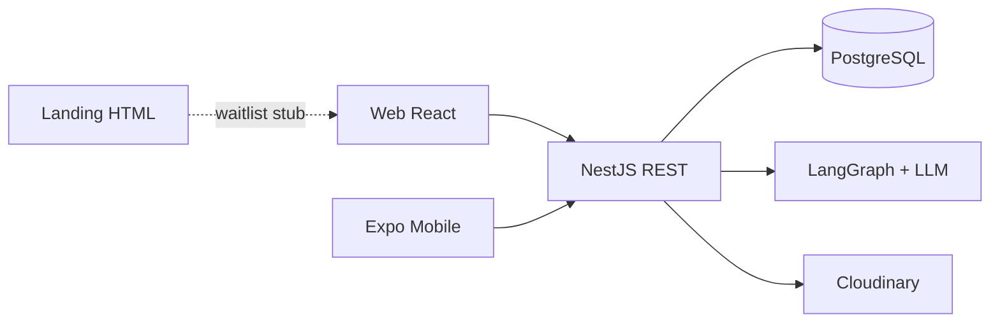

# LarderMind

**LarderMind** is a full-stack meal-planning app: track pantry inventory, plan meals on a calendar, manage recipes, sync a shopping list, and get AI cooking help that remembers your family's preferences.

This repo has **four surfaces** and **one API** (NestJS in `backend-node/`). The former Spring Boot `backend/` has been removed. There is no root monorepo tooling — `frontend/` and `mobile/` are nested git remotes; `backend-node/` lives in this repo.

**Target hosting:** Cloudflare (Pages → web, Workers → API, D1 / R2 / …). See [docs/architecture/cloudflare-target.md](./docs/architecture/cloudflare-target.md).  
**Transition API:** Nest `backend-node` + Postgres (Android launch path unchanged).

---

## Start here (5 minutes)

| If you want to… | Read this |
|-----------------|-----------|
| Understand what exists and what's broken | [PROJECT_STATUS.md](./PROJECT_STATUS.md) |
| **Dev workflow (feature / bug fix) — source of truth** | [docs/workflow/README.md](./docs/workflow/README.md) · [AGENTS.md](./AGENTS.md) |
| See folder layout, APIs, and data model | [docs/Overall Project Structure.md](./docs/Overall%20Project%20Structure.md) |
| Cloudflare target architecture | [docs/architecture/cloudflare-target.md](./docs/architecture/cloudflare-target.md) |
| Cloudflare Workers API (parallel) | [backend-cf/README.md](./backend-cf/README.md) · [docs/features/backend-cf-api.md](./docs/features/backend-cf-api.md) |
| Run the Nest backend | [backend-node/README.md](./backend-node/README.md) |
| iOS / TestFlight launch checklist | [docs/store-launch-todo.md](./docs/store-launch-todo.md) |
| Work on web UI / design tokens | [frontend/src/index.css](./frontend/src/index.css) + [design-system/lardermind/MASTER.md](./frontend/design-system/lardermind/MASTER.md) |

---

## Repo map

```
LarderMind/
├── backend-node/     NestJS + Prisma API (default :8090) — primary
├── backend-cf/       Cloudflare Workers + D1 API (parallel; URL cutover when ready)
├── frontend/         React + Vite web app (nested git remote)
├── mobile/           React Native + Expo mobile app (nested git remote)
├── landing/          Static marketing / waitlist page
├── docs/             Architecture, features, bugs, workflow
├── docs/workflow/    Feature / bug-fix process (source of truth)
├── AGENTS.md         Agent entrypoint → docs/workflow
├── .cursor/rules/    Cursor always-on workflow rule
├── PROJECT_STATUS.md Living status doc (features, gaps, next tasks)
└── tasks/            Task trackers for larger migrations
```

---

## Quick run

### Docker (frontend + Nest API + Postgres)

```powershell
# From repo root — fill backend-node/.env first (see backend-node/.env.example)
docker compose up --build
```

- Web: `http://localhost:3000` (nginx proxies `/api` → Nest)
- API: `http://localhost:8090`

Railway / Render: deploy `backend-node/` and `frontend/` as two services. Set frontend build var `VITE_API_BASE_URL` to your API public URL, and add that origin to `CORS_ALLOWED_ORIGINS`.

### Backend Node (port 8090)

```powershell
cd backend-node
# Copy .env.example → .env and fill in DB + API keys
npm install
npm run prisma:generate
npm run dev
```

API base: `http://localhost:8090`.  
Point web: `VITE_API_BASE_URL=http://localhost:8090`.  
Point mobile: `EXPO_PUBLIC_API_BASE_URL=http://localhost:8090/api/` (or your deployed URL).

### Web app (port 5173)

Start Nest first (`backend-node` on :8090). Vite proxies `/api` and `/auth` to Nest when `VITE_API_BASE_URL` is empty.

```powershell
cd frontend
npm install
npm run dev
```

Optional: set `VITE_API_BASE_URL=http://localhost:8090`. For Cloudflare Pages deploy notes, see `frontend/README.md`.

### Mobile (Expo)

```powershell
cd mobile
npm install
npx expo start
```

Set `EXPO_PUBLIC_API_BASE_URL` to your backend URL (include `/api/` suffix).

### Landing page

Open `landing/index.html` in a browser — no build step.

---

## Domain in one pass

| Concept | What it means in this codebase |
|---------|--------------------------------|
| **Pantry** | Ingredients the user already has (`pantry_items`) |
| **Shopping list** | Items to buy; checking an item can add quantity to pantry |
| **Recipes** | User recipes in folders, with ingredients and instructions |
| **Meal plan** | Scheduled meals on a calendar; missing ingredients auto-added to shopping list |
| **AI assistant** | Nest LangGraph chat with tools: list recipes, create recipe, add to menu, add to shopping list |

Auth: email/password JWT, Google OAuth. JWT stored in `localStorage` (web) or secure storage (mobile).

---

## Brand & UI (web + landing)

Product name: **LarderMind**.

Visual system — **Warm Kitchen**:

| Token | Value | Use |
|-------|-------|-----|
| `--ink` | `#1F2420` | Primary text |
| `--muted` | `#5E675F` | Secondary text |
| `--linen` | `#F3F0E8` | Page background |
| `--surface` | `#FAF8F3` | Raised panels |
| `--herb` | `#4F6B4A` | Accent / CTAs |
| `--sage` | `#D8E0D0` | Selected / soft tint |
| `--line` | `#DDD8CC` | Borders |

Fonts: **Fraunces** (display) + **Source Sans 3** (body).

---

## Architecture

**Now (ship):** Nest + Postgres. **Target:** Cloudflare — [docs/architecture/cloudflare-target.md](./docs/architecture/cloudflare-target.md).



---

## Tests

| Layer | Command | Location |
|-------|---------|----------|
| Backend | `npm test` / `npm run test:e2e` | `backend-node/` |
| Web e2e | `npm run test:e2e` | `frontend/` |
| Mobile | `npm test` | `mobile/` |

---

## Contributing pointers

- Prefer matching existing patterns in the file you're editing (naming, Tailwind usage, API modules under `src/api/`).
- Web styling: use design tokens (`text-herb`, `bg-linen`, etc.).
- Large changes: check `PROJECT_STATUS.md` and `docs/store-launch-todo.md` before duplicating known gaps.
- Do not trust `frontend/README.md` for stack info if it still describes an old Node/Mongo setup.
