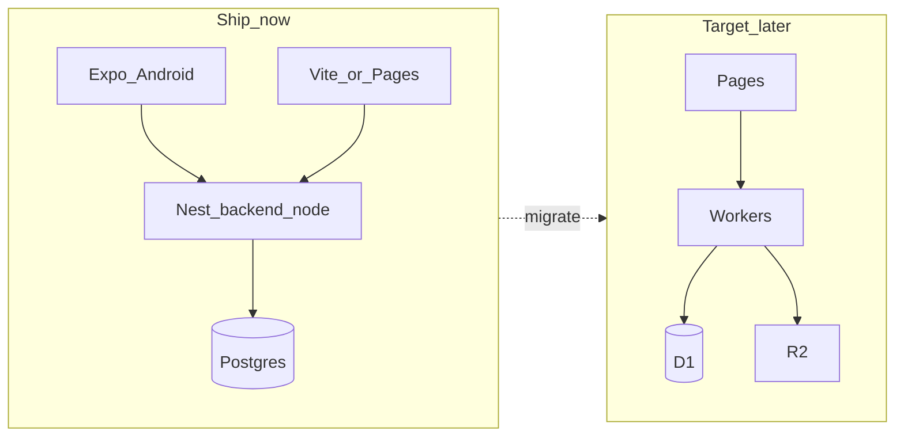

# Cloudflare target architecture

**Status:** Target (aspirational). Not the runtime stack for Android internal testing.  
**Updated:** 2026-09-14

## Goal map

| Cloudflare service | Role |
|--------------------|------|
| Pages | Frontend (React Vite SPA in `frontend/`) |
| Workers | Backend API |
| D1 | SQL database |
| R2 | Object storage (images, uploads) |
| Vectorize | RAG / embeddings |
| Workers AI | On-platform models |
| AI Gateway | AI traffic management, logging, routing |
| Browser Rendering | Agent / browser automation |
| Turnstile | Anti-bot on public forms / auth surfaces |
| Tunnel + Zero Trust | Secure access to local / internal / staging |

## Transition vs target

| Concern | Now (ship Android) | Target (Cloudflare) |
|---------|--------------------|---------------------|
| Web host | Vite local / Railway / Render / **Pages** | Pages |
| API | NestJS `backend-node` (:8090) | Workers |
| Database | PostgreSQL (Prisma) | D1 |
| Media | Cloudinary | R2 |
| AI | Nest LangGraph + external LLM | Workers AI via AI Gateway (+ optional external) |
| Marketing / legal pages | `landing/` static | Pages (separate project or path) |
| Mobile | Expo → Nest | Expo → Workers (same contract when ready) |

Android internal testing and Play launch keep Nest + Postgres. Migrating API/DB is a later program of work; it must not block mobile.

## Suggested migration order

1. **Web on Pages** — host `frontend/` on Cloudflare Pages; API still Nest. Fix CORS + `VITE_API_BASE_URL`.
2. **AI Gateway** — funnel Nest LLM calls through AI Gateway for observability / limits (optional early win).
3. **R2** — replace Cloudinary uploads where practical.
4. **Workers API** — cut routes off Nest behind the same HTTP contract; mobile/web keep one client.
5. **D1** — schema / data migration from Postgres when Workers owns writes.
6. **Vectorize / Browser Rendering / Turnstile / Tunnel** — add when the product needs RAG, agents, bot defense, or private staging access.

## Parallel with Android

- Mobile continues to call Nest (`EXPO_PUBLIC_API_BASE_URL`).
- Web can move to Pages immediately without waiting for Workers.
- `landing/` can become a second Pages project when a public Privacy Policy URL is needed for store listing.

## Parallel API project

Greenfield Worker API lives in **`backend-cf/`** (Hono + D1 + Workers AI). Nest stays primary until clients switch API base URL.

- Feature: [features/backend-cf-api.md](../features/backend-cf-api.md)
- Design: [design/backend-cf-api-design.md](../design/backend-cf-api-design.md)
- Tasks: [tasks/backend-cf-api/README.md](../../tasks/backend-cf-api/README.md)

## Out of scope for the “web first” slice

- No Nest business-logic rewrite in place
- No Postgres → D1 data migration yet
- No change to production API decision in `docs/store-launch-todo.md` (still Nest for this launch round)
