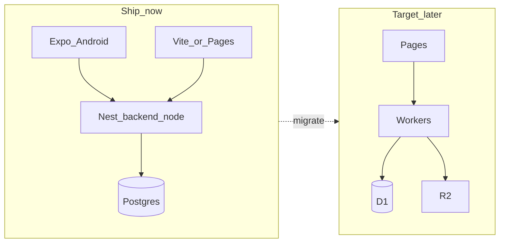

# Cloudflare target architecture

**Status:** Target (aspirational). Not the runtime stack for Android internal testing.  
**Updated:** 2026-09-17

## Goal map

| Cloudflare service | Role |
|--------------------|------|
| Pages | Frontend (React Vite SPA in `frontend/`) — [frontend-cf-pages](../features/frontend-cf-pages.md) |
| Workers | Backend API |
| D1 | SQL database |
| R2 | Object storage (images, uploads) |
| Vectorize | RAG / embeddings — see [Backlog](#backlog-not-started) |
| Workers AI | On-platform models |
| AI Gateway | AI traffic management, logging, routing |
| Browser Rendering | Agent / browser automation — see [Backlog](#backlog-not-started) |
| Turnstile | Anti-bot on public forms / auth surfaces |
| Tunnel + Zero Trust | Secure access to local / internal / staging |

## Transition vs target

| Concern | Now (ship Android) | Target (Cloudflare) |
|---------|--------------------|---------------------|
| Web host | Vite local / Railway / Render / **Pages** | Pages |
| API | NestJS `backend-node` (:8090) | Workers |
| Database | PostgreSQL (Prisma) | D1 |
| Media | Cloudinary | R2 |
| AI | Nest LangGraph + external LLM | **AI Gateway** → DeepSeek (chat) + OpenAI (vision); Workers AI optional/unused |
| Marketing / legal pages | `landing/` static | Pages (separate project or path) |
| Mobile | Expo → Nest | Expo → Workers (same contract when ready) |

Android internal testing and Play launch keep Nest + Postgres. Migrating API/DB is a later program of work; it must not block mobile.

## Suggested migration order

1. **Web on Pages** — host `frontend/` on Cloudflare Pages; build-time `VITE_API_BASE_URL` → Workers; CORS allowlist Pages origin.  
   Active: [features/frontend-cf-pages.md](../features/frontend-cf-pages.md) (CI in **lardermind-frontend**; activate with GitHub secrets/vars).
2. **AI Gateway** — funnel LLM calls through AI Gateway for observability / limits (optional early win).
3. **R2** — replace Cloudinary uploads where practical.  
   Feature: [features/backend-cf-r2-upload.md](../features/backend-cf-r2-upload.md) (D1 = SQL, R2 = images on `backend-cf/`).
4. **Workers API** — full route parity; mobile/web keep one client contract.
5. **D1** — complete product schema / any legacy data migration when Workers owns all writes.
6. **Vectorize / Browser Rendering / Turnstile / Tunnel** — add when the product needs RAG, agents, bot defense, or private staging access. (Concrete ideas under [Backlog](#backlog-not-started).)

## Backlog (not started)

### Vectorize → RAG — 待做

Use Cloudflare Vectorize so the assistant can **retrieve relevant user data** before generating (not dump the whole pantry/recipe DB into the prompt). Candidate product tasks:

| Idea | Status | Notes |
|------|--------|-------|
| 庫存語意推薦 | 待做 | e.g. fridge has chicken + broccoli → rank closest recipes in the user's library |
| 語意搜尋食譜 | 待做 | e.g.「清淡低卡」matches recipes whose titles omit those words |
| RAG 再生成 | 待做 | Before answering, pull relevant pantry / recipe / chat snippets into context |
| 跨語言／模糊描述 | 待做 | User phrasing varies; SQL `LIKE` is not enough |

**Out of scope for this backlog item:** embedding the entire open web; replace D1 as source of truth (D1 stays canonical; Vectorize is the retrieval index).

**Depends on:** recipes (and ideally pantry) living in D1 with a write path that can upsert embeddings; Workers AI (or Gateway) for embed + chat. Prefer this over Browser Rendering once personal recipe volume grows. Add a proper `docs/features/` when ready to build.

### Browser Rendering → Agent — 待做

Use Cloudflare Browser Rendering so the cooking assistant can **open public pages on demand** (not bulk scraping). Candidate product tasks:

| Idea | Status | Notes |
|------|--------|-------|
| 查食譜 | 待做 | Agent opens recipe sites, extracts ingredients / steps for the user |
| 比價 | 待做 | Compare grocery / ingredient prices across public store pages |
| 讀公開菜單 | 待做 | Read restaurant or meal-kit public menus into pantry / meal-plan context |

**Out of scope for this backlog item:** high-volume crawlers, bypassing login walls / CAPTCHA, or non-product automations (e.g. job applications).

**Depends on:** stable Workers API + chat tools; add a proper `docs/features/` when ready to build.

## Parallel with Android

- Mobile continues to call Nest (`EXPO_PUBLIC_API_BASE_URL`).
- Web can move to Pages immediately without waiting for Workers.
- `landing/` can become a second Pages project when a public Privacy Policy URL is needed for store listing.

## Parallel API project

Greenfield Worker API lives in **`backend-cf/`** (Hono + D1 + Workers AI). Nest stays primary until clients switch API base URL.

- Feature: [features/backend-cf-api.md](../features/backend-cf-api.md)
- Design: [design/backend-cf-api-design.md](../design/backend-cf-api-design.md)
- Tasks: [tasks/backend-cf-api/README.md](../../tasks/backend-cf-api/README.md)

## Out of scope for the “web first” slice

- No Nest business-logic rewrite in place
- No Postgres → D1 data migration yet
- No change to production API decision in `docs/store-launch-todo.md` (still Nest for this launch round)
