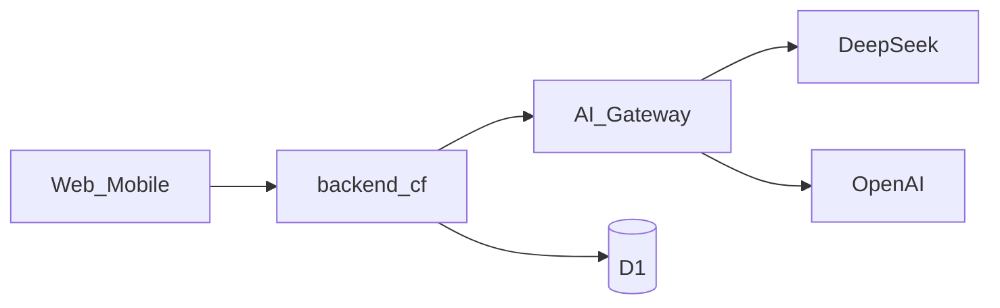

# Technical Design: backend-cf AI Gateway

**Feature reference:** [backend-cf-ai-gateway.md](../features/backend-cf-ai-gateway.md)  
**Status:** Ready to implement  

**Scope:** DeepSeek chat streaming + OpenAI pantry vision through Cloudflare AI Gateway  
**Out of scope:** LangGraph, Unified Billing, client contract changes

---

## 1. Architecture



### 1.1 Gateway URLs

```
https://gateway.ai.cloudflare.com/v1/{CF_ACCOUNT_ID}/{AI_GATEWAY_ID}/deepseek/chat/completions
https://gateway.ai.cloudflare.com/v1/{CF_ACCOUNT_ID}/{AI_GATEWAY_ID}/openai/chat/completions
```

- Auth: `Authorization: Bearer {provider_api_key}`
- Chat: `stream: true`, parse OpenAI-compatible SSE (`data: {choices[0].delta.content}`)
- Vision: non-stream JSON `response_format: json_object` (or schema)

### 1.2 Design decisions

| # | Topic | Decision |
|---|--------|----------|
| 1 | Chat transport | `fetch` to Gateway DeepSeek path; map deltas → existing SSE `token` |
| 2 | Vision transport | Multipart `image` → base64 data URL → Gateway OpenAI path |
| 3 | Keys | `DEEPSEEK_API_KEY` / `OPENAI_API_KEY` as wrangler secrets / `.dev.vars` |
| 4 | Account / gateway | Vars `CF_ACCOUNT_ID`, `AI_GATEWAY_ID` (default `default`) |
| 5 | Apply merge | Case-insensitive name match; add quantities; keep existing unit if present |
| 6 | Quota | Reuse `checkAndIncrementImageUpload` before OpenAI call |

---

## 2. Environment

| Name | Where | Required | Default |
|------|-------|----------|---------|
| `CF_ACCOUNT_ID` | var | Yes | (account from wrangler login) |
| `AI_GATEWAY_ID` | var | Yes | `default` |
| `DEEPSEEK_API_KEY` | secret | Yes for chat | — |
| `LLM_MODEL` | var | No | `deepseek-chat` |
| `OPENAI_API_KEY` | secret | Yes for vision | — |
| `OPENAI_VISION_MODEL` | var | No | `gpt-4o` |
| `OPENAI_VISION_TIMEOUT_MS` | var | No | `60000` |

Deprecate use of `AI_MODEL` / Workers AI for chat (may leave unused).

---

## 3. Chat flow

```
POST /api/chat/stream
  → persist user message + usage
  → if !DEEPSEEK_API_KEY → SSE error "Chat is not configured"
  → status event
  → POST Gateway deepseek/chat/completions { model, messages, stream:true }
  → foreach delta content → event:token
  → persist assistant → event:done
```

Preserve `COOKING_ASSISTANT_SYSTEM_PROMPT` + recent history.

---

## 4. Vision API

### 4.1 `POST /api/pantry-vision/recognize`

- JWT; multipart field `image`
- MIME jpeg/png/webp; ≤ 8MB
- Quota++ then Gateway OpenAI vision
- Response: `{ success, data: { items, message } }`
- Empty: `items: []`, `message: "No food items recognized."`

### 4.2 `POST /api/pantry-vision/apply`

- JWT; `{ items: [{ category?, name, quantity, unit }] }` (1–25)
- Skip blank names; 400 if none valid
- `mergeAddPantryItem` by CI name; return `{ items, added, merged }`

### 4.3 Vision prompt

System: kitchen inventory estimator; return JSON `{ "items": [{ "category", "name", "quantity", "unit" }] }` only. Truncate to 25 server-side.

---

## 5. Module layout

```
backend-cf/src/
  lib/ai-gateway.ts          # URL builders + config helpers
  lib/openai-compat.ts       # stream SSE parse + chat completion helpers
  vision/prompt.ts
  vision/parse.ts
  vision/recognize.ts        # call OpenAI via gateway
  routes/pantry-vision.ts
  agent/stream-chat.ts       # DeepSeek instead of Workers AI
  db/pantry.ts               # mergeAddPantryItem
```

---

## 6. Risks

| Risk | Mitigation |
|------|------------|
| Wrong account/gateway id | Document; clear 502/503 from Gateway |
| Stream format drift | Unit-test delta extractor; tolerate `content` string/array |
| Vision cost abuse | Quota before OpenAI |
| Keys in git | `.dev.vars` gitignored; example only |

---

## 7. Rollback

Revert chat to Workers AI (not recommended — deprecated models) or point clients elsewhere. Secrets remain unused if code rolled back.
