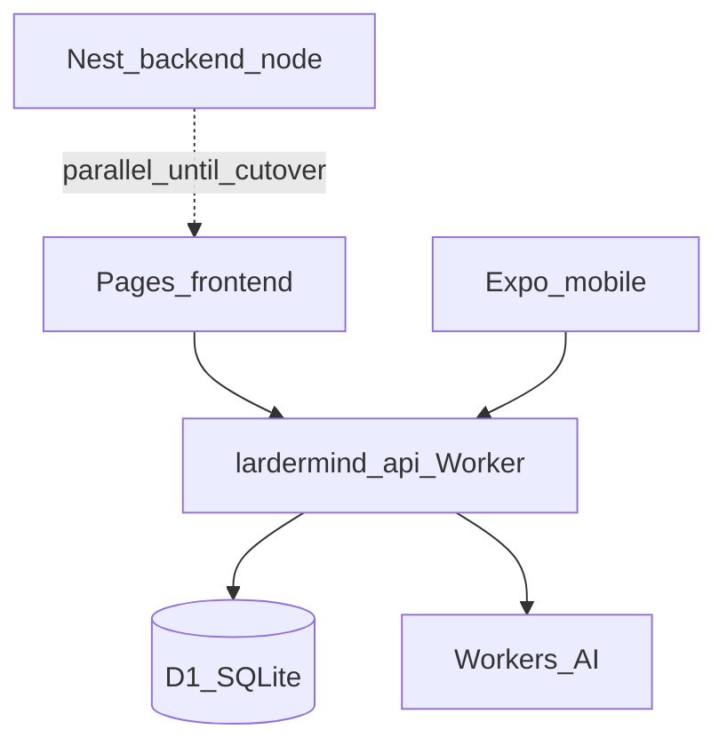

# Technical Design: Cloudflare Backend API

**Feature reference:** [backend-cf-api.md](../features/backend-cf-api.md)  
**Status:** v1 implemented in `backend-cf/`  

**Scope:** `backend-cf/` Workers project — Hono, D1, Workers AI, SSE chat  
**Out of scope:** Nest rewrite, Postgres migration, LangGraph, R2, mobile code changes

---

## 1. Architecture



### 1.1 Repo layout

```
backend-cf/
├── wrangler.toml          # Worker + D1 + AI bindings
├── migrations/0001_init.sql
├── package.json
├── README.md
└── src/
    ├── index.ts           # Hono app entry
    ├── env.ts
    ├── lib/               # api-response, jwt, password, sse
    ├── middleware/        # auth, cors
    ├── db/                # D1 queries
    ├── routes/            # health, auth, chat, subscription
    └── agent/             # stream-chat (Workers AI)
```

### 1.2 Design decisions

| # | Topic | Decision | Rationale |
|---|--------|----------|-----------|
| 1 | Framework | **Hono** on Workers | Small, SSE-friendly, widely used on CF |
| 2 | DB | **D1** with SQL migrations | CF-native; no Prisma on Worker v1 |
| 3 | Password hash | **HMAC-SHA1(salt, password)** hex | Match Nest `password.util.ts` for future migration |
| 4 | JWT | **jose**, payload `{ user_id, iat, exp }`, HS256 | Match Nest `JwtTokenService` |
| 5 | Chat agent | **Workers AI** direct stream, no LangGraph v1 | Cut RAM; add tools in later tasks |
| 6 | SSE events | `token`, `status`, `done`, `error` | Match `frontend/src/api/chat.ts` parser |
| 7 | CORS | `CORS_ALLOWED_ORIGINS` comma list | Same env pattern as Nest |
| 8 | Secrets | `JWT_SECRET` via `wrangler secret` | Never in git |

### 1.3 Chat stream (v1)

```
POST /api/chat/stream  (JWT)
  → load/create session (D1)
  → persist user message
  → Workers AI.run(model, { messages, stream: true })
  → map chunks → SSE event:token
  → persist assistant message
  → SSE event:done { type:'text', message, data:{} }
```

No tool loop, no HITL interrupt in v1.

---

## 2. D1 schema (v1 subset)

Tables in `migrations/0001_init.sql`:

- `users`, `usage_quotas`
- `chat_sessions`, `ai_messages`
- `user_preferences`, `pantry_items` (schema only; CRUD later)

UUIDs as `TEXT`; timestamps as Unix seconds `INTEGER`.

---

## 3. Environment

| Name | Where | Required |
|------|-------|----------|
| `JWT_SECRET` | secret | Yes (≥32 chars) |
| `CORS_ALLOWED_ORIGINS` | wrangler var | Yes |
| `AI_MODEL` | wrangler var | Yes (default `@cf/meta/llama-3.1-8b-instruct`) |
| `JWT_EXPIRES_IN_SECONDS` | wrangler var | Yes |
| `GOOGLE_CLIENT_ID` | secret/var | No (v1) |

Local: `wrangler dev` + `wrangler d1 migrations apply lardermind --local`

---

## 4. Deploy & cutover

1. `wrangler d1 create lardermind` → paste `database_id` in `wrangler.toml`
2. `wrangler secret put JWT_SECRET`
3. `npm run db:migrate:remote`
4. `npm run deploy` → `https://lardermind-api.<account>.workers.dev`
5. Point `VITE_API_BASE_URL` / mobile API base to Worker URL
6. Add Pages/mobile origin to `CORS_ALLOWED_ORIGINS`

Rollback: point URLs back to Nest.

---

## 5. Risks

| Risk | Mitigation |
|------|------------|
| D1 ≠ Postgres users | Document fresh signup on CF; migration task later |
| Workers AI quality vs DeepSeek | Configurable `AI_MODEL`; AI Gateway later |
| SSE timeout on long replies | Shorter prompts v1; split tools to async later |
| Worker CPU limits | No LangGraph; keep turns single-pass |

---

## 6. Future tasks (not v1)

- Tool calling (pantry, recipes) in Worker
- R2 image upload
- AI Gateway for external LLM
- Postgres → D1 migration script
- Google OAuth on Worker
