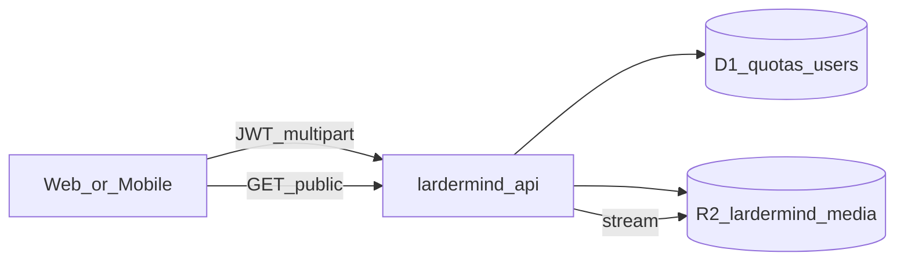

# Technical Design: Cloudflare R2 image upload

**Feature reference:** [backend-cf-r2-upload.md](../features/backend-cf-r2-upload.md)  
**Status:** Implemented  
**Scope:** `backend-cf/` — R2 binding, upload/delete/media routes, D1 quota column  
**Out of scope:** Nest, Cloudinary migration, client UI wiring, image transforms

---

## 1. Architecture



| Store | Holds |
|-------|--------|
| **D1** | Users, auth, `usage_quotas.image_uploads`, future recipe rows with `image_url` text |
| **R2** | Image bytes only |

### 1.1 Design decisions

| # | Topic | Decision | Rationale |
|---|--------|----------|-----------|
| 1 | Bucket name | `lardermind-media` | Matches commented stub in `wrangler.toml` |
| 2 | Binding | `R2` (`Env.R2` required after this feature) | Already typed optional in `env.ts` |
| 3 | Multipart field | **`file`** | Common FormData name; document for clients |
| 4 | Object key | `{userId}/{uuid}.{ext}` | Ownership + uniqueness; `publicId` = full key |
| 5 | `imageUrl` | `{origin}/api/media/{publicId}` | Same API host; no extra CDN domain in v1 |
| 6 | Media GET | Public, no JWT | Recipe images are shareable display assets |
| 7 | Cache | `Cache-Control: public, max-age=31536000, immutable` | UUID keys are content-addressed enough for v1 |
| 8 | Delete missing | **404** | Clearer than silent success for debugging |
| 9 | Quota period | Calendar month via `image_period_start` (Unix) | Align with Nest `image_uploads` metaphor |
| 10 | Pro unlimited | If subscription stub says pro **or** `role === 'admin'` → skip cap | Minimal; refine when billing lands on CF |
| 11 | Ext from MIME | jpeg→`jpg`, png→`png`, webp→`webp`, gif→`gif` | Stable Content-Type on read |

### 1.2 Repo touchpoints

```
backend-cf/
├── wrangler.toml              # uncomment [[r2_buckets]]
├── migrations/0002_image_uploads.sql
├── src/
│   ├── env.ts                 # R2: R2Bucket (required)
│   ├── index.ts               # mount upload + media routes
│   ├── db/quotas.ts           # checkAndIncrementImageUpload
│   ├── lib/media.ts           # key helpers, MIME map
│   └── routes/
│       ├── upload.ts          # POST/DELETE /api/upload/image
│       └── media.ts           # GET /api/media/*
└── README.md                  # bucket create + routes
```

---

## 2. Data model

### 2.1 D1 migration `0002_image_uploads.sql`

```sql
ALTER TABLE usage_quotas ADD COLUMN image_uploads INTEGER NOT NULL DEFAULT 0;
ALTER TABLE usage_quotas ADD COLUMN image_period_start INTEGER;
```

- On first upload (or period rollover): set `image_period_start` to start of current UTC month; reset `image_uploads` to 0 if month changed, then increment.
- Free cap: **10** per period.
- Signup path that creates `usage_quotas` rows needs no change if defaults apply; verify insert columns still valid.

### 2.2 R2 object

| Attribute | Value |
|-----------|--------|
| Key | `{userId}/{uuid}.{ext}` |
| HTTP metadata | `contentType` from validated MIME |
| Custom metadata (optional) | `uploadedBy=userId` |

No D1 row per upload in v1 — recipes will store `imageUrl` / `publicId` when recipe CRUD lands.

---

## 3. API

Envelope: existing `{ success, message, data? }` via `lib/api-response.ts`.

### 3.1 `POST /api/upload/image`

| Item | Detail |
|------|--------|
| Auth | Bearer JWT (`authMiddleware`) |
| Body | `multipart/form-data`, field **`file`** |
| Success **200** | `data: { imageUrl: string, publicId: string }` |
| Errors | **400** missing/invalid file or MIME; **401** no/invalid JWT; **403** over quota; **413** > 8 MB |

Flow:

1. Authenticate → `userId`.
2. Parse multipart; validate MIME + size.
3. `checkAndIncrementImageUpload(userId)` — fail → 403.
4. `R2.put(key, bytes, { httpMetadata: { contentType } })`.
5. Build `imageUrl` from request origin (or `c.req.url` base) + `/api/media/` + encodeURIComponent segments carefully (see §3.3).
6. Return envelope.

If `R2.put` fails after quota increment: log; return 500. (Accept rare quota burn; no decrement in v1.)

### 3.2 `DELETE /api/upload/image/:publicId{.+}`

| Item | Detail |
|------|--------|
| Auth | JWT |
| Param | `publicId` = R2 key (may contain `/`) — use Hono path with regex / splat |
| Success **200** | `{ success: true, message: '...' }` |
| Errors | **401**; **403** if key does not start with `{userId}/`; **404** if object missing |

Flow: verify prefix → `R2.head` or `get` → if missing 404 → `R2.delete(key)`.

### 3.3 `GET /api/media/:userId/:objectName`

Prefer **two path segments** instead of opaque encoded key:

- Upload returns `publicId = "{userId}/{uuid}.jpg"`.
- `imageUrl = "{origin}/api/media/{userId}/{uuid}.jpg"`.

Validation on GET: `userId` UUID-shaped; `objectName` matches `^[0-9a-f-]{36}\.(jpg|png|webp|gif)$` (case-insensitive). Reject otherwise → 404.

Response: body stream from R2; `Content-Type` from object metadata; cache headers per decision #7.

---

## 4. Quota helper

`db/quotas.ts`:

```ts
// Pseudocode
async function checkAndIncrementImageUpload(db, userId, isPro): Promise<void>
```

- Load or create `usage_quotas` for user.
- If `!isPro` and period rolled → reset counter.
- If `!isPro` and `image_uploads >= 10` → throw / return forbidden.
- Else `image_uploads += 1`, update timestamps.

`isPro`: for v1 call existing subscription stub status if available; else treat all as free except `role === 'admin'`.

---

## 5. Wrangler / ops

```toml
[[r2_buckets]]
binding = "R2"
bucket_name = "lardermind-media"
```

Commands (document in README):

```powershell
npx wrangler r2 bucket create lardermind-media
npm run db:migrate:local   # applies 0002
npm run db:migrate:remote
npm run deploy
```

Local: `wrangler dev` provides simulated R2; no Cloudflare login required for upload smoke (unlike Workers AI).

CI (`.github/workflows/backend-cf.yml`): deploy already uses account token — ensure token permission includes **Workers R2 write** (document in design/README; human may need to widen API token).

---

## 6. Tests

| Case | Expect |
|------|--------|
| Upload jpeg under limit | 200 + GET media returns bytes |
| Wrong MIME / oversize | 400 / 413 |
| 11th upload free user | 403 |
| Delete own | 200; GET → 404 |
| Delete other user’s key | 403 |
| GET garbage path | 404 |

Prefer Vitest + Workers/miniflare patterns already used in `backend-cf` if present; otherwise add minimal route unit tests with mocked `R2` / `DB` bindings.

---

## 7. Risks

| Risk | Mitigation |
|------|------------|
| Public media hotlinking | Acceptable v1; rate limits / referer later |
| Quota incremented but put fails | Rare; monitor logs; optional compensate later |
| API token lacks R2 in CI | Document required permissions before merge |
| Long keys in DELETE URL | Use splat route; avoid double-encoding bugs |
| Clients not wired | Explicit non-goal; contract frozen for follow-up |

---

## 8. Follow-ups (not this feature)

- Frontend / mobile `ImageUploader` against CF base URL
- Recipe CRUD storing `image_url` in D1
- Custom domain / R2 public bucket for CDN-style URLs (optional; Worker edge already caches with Cache-Control)
- Cloudflare Images transforms
- Cloudinary → R2 bulk migrate if Nest path ever returns
