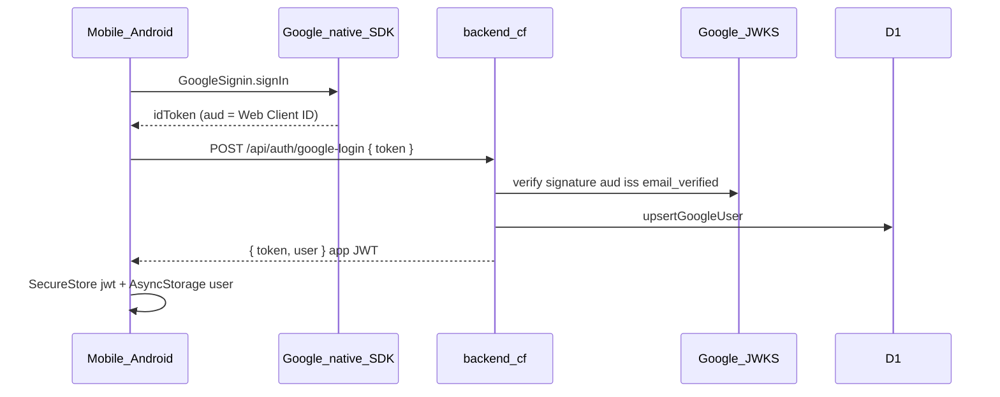

# Technical Design: Mobile Android Google Sign-In

**Feature reference:** [mobile-android-google-signin.md](../features/mobile-android-google-signin.md)  
**Status:** Implemented  
**Scope:** `mobile/` native Google on Android → existing `backend-cf` `google-login`  
**Out of scope:** iOS, Apple, Worker redesign

---

## 1. Architecture



### 1.1 Design decisions

| # | Topic | Decision | Rationale |
|---|--------|----------|-----------|
| 1 | Library | `@react-native-google-signin/google-signin` | Expo-supported; avoid bumping `nitro-modules` (IAP peer) required by Nitro Google package |
| 2 | `webClientId` | Web OAuth Client ID via `EXPO_PUBLIC_GOOGLE_WEB_CLIENT_ID` | ID token `aud` matches Worker `GOOGLE_CLIENT_ID` |
| 3 | Android client ID | Console only | Package + SHA-1; not passed as audience |
| 4 | Backend | No Worker change | Existing verify + upsert |
| 5 | Platform gate | `Platform.OS === 'android'` | Feature scope |
| 6 | Shared flow | Same `loginWithGoogle` on Login + SignUp | Backend creates or links user |
| 7 | Session | Reuse email login storage path | SecureStore JWT + AsyncStorage user |
| 8 | Native module | Config plugin + rebuild | Not Expo Go |

### 1.2 Repo touchpoints

```
mobile/
├── app.json                         # plugin @react-native-google-signin/google-signin
├── .env.example                     # EXPO_PUBLIC_GOOGLE_WEB_CLIENT_ID
├── package.json                     # dependency
├── jest.setup.js                    # mock Google Sign-In + i18n keys
├── src/
│   ├── api/api-auth.ts              # googleLogin
│   ├── contexts/authContext.tsx     # loginWithGoogle
│   ├── services/googleSignIn.ts     # configure + signInForIdToken
│   ├── screens/LoginScreen.tsx
│   ├── screens/SignUpScreen.tsx
│   └── __tests__/...
```

Parent docs only under `docs/` + `tasks/` (this feature). No `backend-cf` code unless acceptance proves `aud` mismatch.

---

## 2. Data model

No schema change. Worker already maps Google profile → `users.google_id` / email link / create.

---

## 3. Interfaces

### 3.1 Backend (unchanged)

`POST /api/auth/google-login` body `{ token: string }` → `{ success, data: { token, user } }`.

Mobile client path (base ends with `/api/`): `auth/google-login`.

### 3.2 Mobile API

```typescript
auth.googleLogin(idToken: string): Promise<ApiResponse<{ user: User; token: string }>>;
// POST auth/google-login { token: idToken }
```

### 3.3 Auth context

```typescript
loginWithGoogle(): Promise<AuthResponse>;
```

### 3.4 Google service

```typescript
configureGoogleSignIn(): void; // once; no-op if missing webClientId in prod warn
signInForIdToken(): Promise<string>; // throws typed errors: cancelled | missing_token | native
```

Configure:

```typescript
GoogleSignin.configure({
  webClientId: process.env.EXPO_PUBLIC_GOOGLE_WEB_CLIENT_ID,
  offlineAccess: false,
});
```

Sign-in flow (library v13+ style):

1. `hasPlayServices({ showPlayServicesUpdateDialog: true })`
2. `signIn()`
3. Extract `idToken` from success response; throw if absent

---

## 4. UI

- Android only: divider (`common.or`) + `SecondaryButton` labeled `auth.signInGoogle` / `auth.signUpGoogle`.
- Place Google CTA **above** email fields or below primary email submit — prefer **below primary email button, above “no account” link** on Login; same pattern on SignUp (below Sign up button).
- Disable while `submitting`.
- Errors: `auth.googleCancelled`, `auth.googleRetry`, backend message when present.

---

## 5. Config

| Var | Example |
|-----|---------|
| `EXPO_PUBLIC_GOOGLE_WEB_CLIENT_ID` | `603047692060-llk1cjf1b0f5bpdb9it5cvogk2b8haio.apps.googleusercontent.com` |
| `EXPO_PUBLIC_API_BASE_URL` | `https://api.lardermind.com/api/` (or local Worker tunnel) |
| Worker `GOOGLE_CLIENT_ID` | Same Web Client ID (already set) |

---

## 6. Risks

| Risk | Mitigation |
|------|------------|
| `DEVELOPER_ERROR` | Document package + SHA-1; add release SHA-1 before Play |
| Expo Go | Already using dev client; README note in feature acceptance |
| Legacy Android GMS deprecation | Accept for v1; future migrate to Nitro/Credential Manager when nitro-modules aligns |
| Jest Platform = ios preset | Mock `Platform.OS` or assert Google hidden on ios default; separate android test |

---

## 7. Test plan

- Unit: `auth.googleLogin` posts `{ token }` to `auth/google-login`.
- Unit: `loginWithGoogle` stores JWT + user on success (mock api + google service).
- Screen: Android mock shows Google button; press calls `loginWithGoogle`.
- Screen: default ios jest — Google button absent (Login/SignUp).
- Manual: rebuild Android → Google → land authenticated against Worker.
