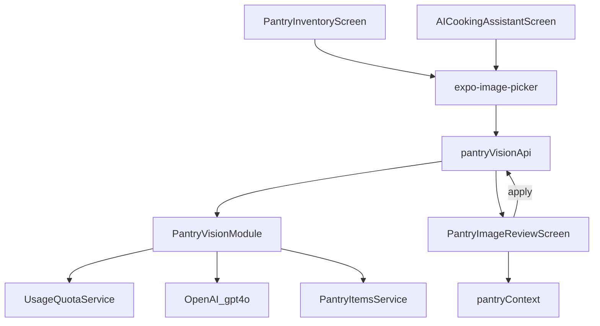

# Technical Design: Pantry Image Recognition (Mobile)

**Feature reference:** [pantry-image-recognition.md](../features/pantry-image-recognition.md)  
**Status:** Implemented  

**Scope:** Nest (`backend-node/`) vision + apply APIs; mobile Pantry + Chat entry + shared review screen  
**Out of scope:** Web, Spring, DeepSeek multimodal, offline vision, recognition history table

---

## 1. Architecture Overview

### 1.1 Where it fits

```
PantryInventoryScreen ──┐
                        ├── pickImage ──► POST /api/pantry-vision/recognize
AICookingAssistantScreen┘                              │
                                                       ▼
                                              OpenAI gpt-4o (structured JSON)
                                                       │
                                                       ▼
                                         navigate PantryImageReview (draft)
                                                       │
                                              user edits / cancel
                                                       │ confirm
                                                       ▼
                                         POST /api/pantry-vision/apply
                                                       │
                                              PantryItemsService merge-add
                                                       ▼
                                         refresh pantryContext + close
```



Text chat / LangGraph / DeepSeek are **unchanged**. Chat attach never posts the image to `/api/chat`.

### 1.2 Design decisions (resolves feature §10)

| # | Topic | Decision | Rationale |
|---|--------|----------|-----------|
| 1 | Recognize transport | **Multipart** `image` field → Nest; Nest sends **data URL / base64** to OpenAI | No Cloudinary dependency for vision; ephemeral |
| 2 | Confirm write | **`POST /api/pantry-vision/apply`** with edited items JSON | One merge-add path; avoids client inventing upsert; matches chat tool semantics |
| 3 | Unit on merge | If same unit-kind as existing row, **convert then add**; else **raw add** and keep existing unit if set, else take incoming (chat parity + small improvement) | Avoid kg+g scalar bugs when convertible |
| 4 | Category | **UI-only** in draft/review; **not** persisted to `notes` or schema in v1 | No ingredient.category column; avoids polluting notes |
| 5 | Quota | Reuse **`image_uploads`** via `checkAndIncrementImageUpload` **before** OpenAI call | Same product metaphor; no new entitlement field |
| 6 | Limits | Max **25** draft items; image ≤ **8MB**; MIME jpeg/png/webp; OpenAI timeout **60s**; client resize longest side **1280px**, JPEG quality ~0.7 | Cost + latency |
| 7 | Navigation | Hidden **Drawer.Screen** `PantryImageReview` (like Subscription) | Minimal nav churn; `navigate('PantryImageReview', params)` |
| 8 | Image retention | **Not** uploaded to Cloudinary for recognition; buffer discarded after request | Privacy + cost |
| 9 | Quota on OpenAI failure | Increment **before** call (same as upload today) | Prevents retry abuse; document in UX |
| 10 | Draft duplicates | On apply, process sequentially with merge-add so duplicate names in one confirm **accumulate** | Predictable |

### 1.3 Conflicts raised + resolved

| Conflict | Resolution |
|----------|------------|
| Template path `docs/designs/` vs repo `docs/design/` | Use **`docs/design/`** (repo convention) |
| `PUT /api/pantry-item/bulk` **sets** qty, chat tools **add** qty | Apply endpoint uses **merge-add** (extract shared helper on `PantryItemsService`) |
| No `canConvert` | Use `kindOf(unit)` equality + `convert()`; on throw, fall back to raw add |
| Chat expects multimodal Q&A | Attach control labeled for pantry add; optional local success chip only |

---

## 2. Data Models / Schema

### 2.1 Database

**No Prisma schema changes** for v1.

### 2.2 Draft item (API + mobile)

```ts
type RecognizedPantryItemDto = {
  category: string;   // e.g. produce | dairy | meat | seafood | bakery | pantry | beverage | other
  name: string;
  quantity: number;
  unit: string;       // e.g. g, kg, ml, L, pcs
};
```

### 2.3 Env

| Var | Required | Default |
|-----|----------|---------|
| `OPENAI_API_KEY` | for vision calls | — |
| `OPENAI_VISION_MODEL` | optional | `gpt-4o` |
| `OPENAI_VISION_TIMEOUT_MS` | optional | `60000` |

Wire through `env.schema.ts` → `app.optional.openaiApiKey` / `openaiVisionModel` / `openaiVisionTimeoutMs`.

---

## 3. Interface Design

### 3.1 `POST /api/pantry-vision/recognize`

- Auth: JWT  
- Body: `multipart/form-data` field `image` (file)  
- Pre: validate MIME/size → `checkAndIncrementImageUpload(userId)` → OpenAI  
- Success `200`:

```json
{
  "success": true,
  "data": {
    "items": [
      { "category": "produce", "name": "tomato", "quantity": 300, "unit": "g" }
    ],
    "message": null
  }
}
```

- Empty recognition: `items: []`, `message: "No food items recognized."`  
- Errors: 400 bad image, 402/403 quota (existing `QuotaExceededError`), 503 missing key / OpenAI failure (no stack/secrets)

### 3.2 `POST /api/pantry-vision/apply`

- Auth: JWT  
- Body:

```json
{
  "items": [
    { "category": "produce", "name": "tomato", "quantity": 250, "unit": "g" }
  ]
}
```

- Validate: 1–25 items; each `name` non-empty trim; `quantity` ≥ 0; `unit` optional string  
- `category` accepted but **ignored for persistence**  
- Success: `{ success, data: { items: PantryItemDto[], added: number, merged: number } }`  
- Does **not** consume image quota again

### 3.3 Nest module layout

```
backend-node/src/pantry-vision/
  pantry-vision.module.ts
  pantry-vision.controller.ts
  pantry-vision.service.ts
  openai-vision.client.ts
  dto/recognize-apply.dto.ts
  pantry-vision.service.spec.ts
  openai-vision.prompt.ts
```

Register `PantryVisionModule` in `AppModule` (imports: `UsageQuotaModule`, `PantryItemsModule`).

### 3.4 `PantryItemsService` addition

```ts
async mergeAddItem(
  userId: string,
  input: { name: string; quantity: number; unit?: string; notes?: string },
): Promise<{ item: PantryItemDto; merged: boolean }>
```

- Resolve/create ingredient by name (reuse private `resolveIngredient` / create path).  
- If pantry row exists for `(userId, ingredientId)`:
  - Same `kindOf`: `convert(incomingQty, incomingUnit, existing.unit)` then add to `existing.quantity`; keep `existing.unit`.
  - Else: `existing.quantity + incomingQty`; unit = `existing.unit || incomingUnit`.
- Else create.  
- `apply` loops items and calls this.  
- Optionally refactor chat `insertAllPantryItems` later to call the same helper (nice-to-have, not blocking).

### 3.5 OpenAI call

- `openai` SDK or raw `fetch` to `https://api.openai.com/v1/chat/completions`  
- Model: `gpt-4o` (or env override)  
- Message: system prompt (kitchen inventory estimator) + user content with `image_url` data URL  
- `response_format: { type: "json_schema", ... }` or `json_object` with validated Zod/class-validator parse  
- Schema: `{ items: [{ category, name, quantity, unit }] }`  
- Truncate to 25 items server-side  
- Strip empty names; clamp quantity ≥ 0

### 3.6 Mobile API + screens

| Piece | Path |
|-------|------|
| Client | `mobile/src/api/pantryVision.ts` — `recognize(uri)`, `apply(items)` |
| Shared pick helper | `mobile/src/utils/pantryImagePick.ts` — camera/library + optional resize |
| Review screen | `mobile/src/screens/PantryImageReviewScreen.tsx` |
| Register | `App.tsx` Drawer.Screen `PantryImageReview` hidden |
| Entry A | Camera icon on `PantryInventoryScreen` header/actions |
| Entry B | Paperclip/camera left of composer in `AICookingAssistantScreen` |

Review route params:

```ts
{
  items: RecognizedPantryItemDto[];
  imageUri?: string;
  source: 'pantry' | 'chat';
  emptyMessage?: string;
}
```

---

## 4. Business Logic Flow

### 4.1 Recognize

1. User picks/captures image (permissions).  
2. Client may resize to max 1280px JPEG.  
3. `POST recognize` multipart.  
4. Server validates → quota++ → OpenAI → parse/validate → return drafts.  
5. Client navigates to `PantryImageReview` with drafts (even if empty — show empty state).  
6. User can Cancel (goBack) with no apply.

### 4.2 Apply

1. User edits rows (name/qty/unit/category), removes lines; Confirm enabled iff ≥1 row with non-empty name.  
2. `POST apply` with edited items (category included but ignored server-side).  
3. Server merge-adds each; returns counts.  
4. Client `fetchAllPantryItems()`, Alert/toast success, `goBack()`.  
5. If `source === 'chat'`, optional local assistant bubble “Added N items to pantry” **without** calling chat send API (append to local messages state if easy; else toast only).

### 4.3 Cancel / errors

- Picker cancel → no-op.  
- Recognize fail → Alert; stay on entry screen.  
- Apply fail → Alert; stay on review with draft intact for retry.  
- Double-tap Confirm → disable button while in flight.

---

## 5. Edge Cases & Error Handling

| Case | Handling |
|------|----------|
| Missing `OPENAI_API_KEY` | 503 “Vision is not configured” |
| OpenAI 429/5xx/timeout | 503 friendly message; quota already consumed |
| Invalid JSON from model | 503 / 502 parse error; empty not written |
| Quota exceeded | Existing quota error envelope; no OpenAI call |
| Apply with 0 items | 400 |
| Apply name blank | Skip or 400 — **skip blank names**, error if all blank |
| Unit convert throws | Fall back to raw numeric add |
| Abort recognize | Client abandons response; no special server cancel |

---

## 6. Performance & Security

### Performance

- One image per recognize; client resize before upload.  
- Cap 25 items.  
- Apply is sequential merge (N small); acceptable for v1.  
- No Cloudinary round-trip on recognize path.

### Security

- JWT on both endpoints.  
- Key server-only.  
- Validate MIME/size.  
- Treat model JSON as untrusted; schema-validate before return/apply.  
- Do not log base64/image buffers.  
- Apply only uses client-confirmed fields after validation (not raw model replay without user edit opportunity — user always lands on review first).

---

## 7. Testing

| Layer | Coverage |
|-------|----------|
| `openai-vision` parse/truncate | Unit: sample JSON → DTOs; oversize truncated |
| `mergeAddItem` | Unit: create, merge same unit, merge convertible units, incompatible fallback |
| `PantryVisionService.recognize` | Mock quota + OpenAI client |
| `PantryVisionService.apply` | Mock pantry merge |
| Mobile review | Unit/component: edit/remove → apply payload shape |

---

## 8. i18n keys (mobile)

Add under existing namespaces, e.g.:

- `pantryVision.scan`, `pantryVision.reviewTitle`, `pantryVision.confirm`, `pantryVision.cancel`
- `pantryVision.empty`, `pantryVision.approxHint`, `pantryVision.success`, `pantryVision.error*`
- `pantryVision.attach` (chat a11y)

---

## 9. Implementation order

See `tasks/pantry-image-recognition/`. Backend foundation → apply/merge → mobile API/review → entry points → tests → acceptance.
