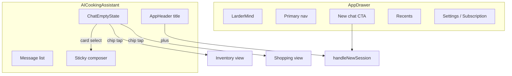

# Technical Design: Web Agent Chat UX

**Feature reference:** [web-agent-chat-ux.md](../features/web-agent-chat-ux.md)  
**Status:** Implemented  
**Scope:** `frontend/` Chat empty state, composer, Chat header title, drawer New chat placement  
**Out of scope:** Backend, mobile, attach/vision, persistent desktop drawer, landing/demo restyle

---

## 1. Architecture Overview

### 1.1 Where it fits

No shell/IA rewrite. Polish components introduced by `web-chat-first-nav`:



### 1.2 Design decisions (resolves feature §10)

| # | Topic | Decision | Rationale |
|---|--------|----------|-----------|
| 1 | Short greeting | Named: `ai.greetingHi` → “Hi, {{name}}”; unnamed: period greeting only | One line; agent-like; keeps Warm Kitchen voice |
| 2 | Welcome helper | **Remove** from empty state when suggestions exist | Reduces stack; cards + placeholder carry the cue |
| 3 | Suggestion shape | i18n `ai.suggestedPromptCards`: `{ title, prompt }[]` (en/zh) | Short label ≠ full prompt for Import URL case |
| 4 | Card layout | CSS grid `grid-cols-2 gap-2` max-w-md; title 1–2 lines `line-clamp-2` | Modern agent starter grid |
| 5 | Chip labels | `ai.chipPantry` / `ai.chipBuy` with `{{count}}` → e.g. `Pantry · {{count}}` | Scannable; not full sentences |
| 6 | Missing nav callbacks | If `onViewPantry` / `onViewShoppingList` absent → **omit** that chip | Avoid dead controls |
| 7 | Empty vertical align | Keep `justify-center` but **reduce** margins (`mb-8` → tighter); max width unchanged | Fixes “empty” feel without mid-page composer |
| 8 | Composer chrome | `bg-surface` + `border-line` + `shadow-sm`; min-h ~52px; focus ring herb/30 | Align intent with mobile composer redesign |
| 9 | Send idle | Icon-only muted (`text-muted`) when `!canSend`; `bg-herb text-white` when ready | Clear affordance |
| 10 | Placeholder | `ai.placeholder` → cooking/pantry/planning phrasing | Product-specific |
| 11 | Header title | `messages.length === 0` → `t('nav.newChat')`; else `currentSession?.title?.trim() \|\| t('nav.aiChat')` | Session-aware |
| 12 | Drawer New chat | Place **below primary nav, above Recents** (full-width herb button); remove from sticky footer | Discoverability; footer = Settings + Subscription only |
| 13 | Attach | **Not implemented** | Explicit non-goal |
| 14 | Persistent drawer | **No change** | Overlay remains |

No DB / API schema changes.

### 1.3 Architectural conflicts

| Conflict | Resolution |
|----------|------------|
| `home.welcomeBack` still used elsewhere? | Keep key; Chat empty stops using it for headline |
| `ai.suggestedPrompts` string[] used by DemoChatBox? | Keep array for demo; Chat switches to `suggestedPromptCards` |
| `PlusCircleIcon` unused import in Chat | Clean up if still unused after composer work |
| Design-system MASTER still describes old empty | Update Chat empty + composer pattern in task |

---

## 2. Data Models / Schema

None new.

### 2.1 Suggestion card (i18n object)

```ts
type SuggestedPromptCard = {
  title: string;  // short UI label
  prompt: string; // full text sent / filled into composer
};
```

`ChatEmptyState` accepts:

```ts
suggestedPromptCards?: SuggestedPromptCard[];
onSelectPrompt?: (prompt: string) => void;
onViewPantry?: () => void;
onViewShoppingList?: () => void;
```

Deprecate prop `suggestedPrompts?: string[]` on `ChatEmptyState` (remove once Chat migrated).

### 2.2 Header title derivation (in `AICookingAssistant`)

```ts
const headerTitle =
  messages.length === 0
    ? t('nav.newChat')
    : (sessions.find(s => s.id === currentSessionId)?.title?.trim() || t('nav.aiChat'));
```

(Use whatever session title source already exists in the component — do not add a new fetch.)

---

## 3. Interface Design

### 3.1 i18n keys (add / change)

```json
"ai": {
  "greetingHi": "Hi, {{name}}",
  "placeholder": "Ask about cooking, pantry, or planning…",
  "chipPantry": "Pantry · {{count}}",
  "chipBuy": "Buy · {{count}}",
  "suggestedPromptCards": [
    { "title": "Cook with what I have", "prompt": "What can I cook with what I have?" },
    { "title": "Plan this week’s dinners", "prompt": "Plan dinners for the rest of this week" },
    { "title": "Import a recipe", "prompt": "Import a recipe from a URL (website, YouTube, or Instagram)" },
    { "title": "Add items to pantry", "prompt": "Add chicken, rice, and broccoli to my pantry" }
  ]
}
```

zh mirrors (tone: 自然、短標):

| Key | zh (locked intent) |
|-----|--------------------|
| `greetingHi` | `你好，{{name}}` |
| `placeholder` | `問烹飪、食材庫或規劃…` |
| `chipPantry` | `食材庫 · {{count}}` |
| `chipBuy` | `待購 · {{count}}` |
| Card titles | 短標對齊 en（例如「用現有食材煮」、「規劃本週晚餐」、「匯入食譜」、「加入食材庫」） |

Keep `ai.suggestedPrompts` for demo/landing if still referenced.

### 3.2 `ChatEmptyState` layout

```
[ Hi, Bao ]                    font-display, one h2
[ Pantry · 0 ] [ Buy · 0 ]     chip row, gap-2, mt-4
[ card ] [ card ]              grid-cols-2, mt-6, max-w-md
[ card ] [ card ]
```

Chip button classes (conceptual): `rounded-full border border-line bg-surface px-3 py-1.5 text-sm text-ink hover:bg-sage/50`.

Card button classes: `rounded-xl border border-line bg-sage/30 hover:bg-sage/50 text-left text-sm font-medium text-ink px-3 py-3 min-h-[3.25rem]`.

### 3.3 Composer (AICookingAssistant footer)

```
footer: bg-linen, quiet top hairline (keep or soften)
  field: rounded-[22px] border border-line bg-surface shadow-sm
         focus-within:ring-2 focus-within:ring-herb/30
  textarea: min-h-[52px] max-h-40 py-3 pl-4 pr-12
  send: absolute bottom/right; muted icon if !canSend; herb circle if canSend
```

`canSend = Boolean(inputValue.trim()) && !isTyping` (and any existing HITL disable rules).

### 3.4 AppDrawer reorder

1. Brand row  
2. Primary nav  
3. **`+ New chat`** (herb, full width, `mb-4`)  
4. Recents label + list / empty  
5. Sticky footer: Settings, Subscription only  

`onNewChat` behavior unchanged.

---

## 4. Business Logic Flow

### 4.1 Suggestion select

Unchanged: `onSelectPrompt(prompt)` → existing Chat handler fills and/or sends (keep current behavior in `AICookingAssistant`).

### 4.2 Context chips

1. Tap Pantry chip → `onViewPantry?.()` (App already passes pantry navigation into Chat).  
2. Tap Buy chip → `onViewShoppingList?.()`.  
3. Do not clear chat session.

### 4.3 Header title updates

Recompute on `messages` / current session title changes. After New chat clears messages → title flips to New chat.

---

## 5. Edge Cases & Error Handling

| Case | Handling |
|------|----------|
| `suggestedPromptCards` missing / not array | Render no grid |
| Chip callback undefined | Omit chip |
| Session title empty with messages | Fallback `nav.aiChat` |
| i18n returnObjects type | Runtime `Array.isArray` + shape guard (`title` + `prompt` strings) |

---

## 6. Performance & Security

- No new network calls.  
- Chips only switch client views.  
- Static i18n prompts only.

---

## 7. Test plan

- Unit (optional): small helper to normalize `suggestedPromptCards` from i18n if extracted.  
- Manual: empty Chat → greeting one line; chips navigate; cards send full prompts; composer send states; header title empty vs titled session; drawer New chat above Recents; zh locale.  
- `tsc --noEmit` on touched frontend paths.

---

## 8. File change list

| Action | Path |
|--------|------|
| Modify | `frontend/src/components/ChatEmptyState.tsx` |
| Modify | `frontend/src/components/AICookingAssistant.tsx` |
| Modify | `frontend/src/components/AppDrawer.tsx` |
| Modify | `frontend/src/i18n/locales/en.json` |
| Modify | `frontend/src/i18n/locales/zh.json` |
| Modify | `frontend/design-system/lardermind/MASTER.md` |
| Optional | `frontend/src/components/ChatEmptyState.test.tsx` or util test |
| Touch only if needed | `AppHeader.tsx` (likely title string only from parent) |

---

## 9. Implementation order

Aligns with `tasks/web-agent-chat-ux/`:

1. i18n (greeting, chips, cards, placeholder)  
2. P0 composer + empty greeting density  
3. P1 suggestion cards + header title  
4. P2 chips wiring + drawer New chat move  
5. Design-system + acceptance  
