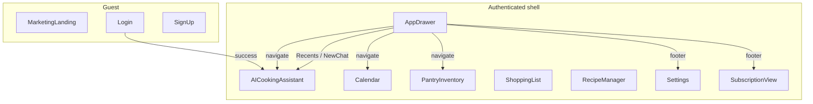

# Technical Design: Web Chat-First Navigation

**Feature reference:** [web-chat-first-nav.md](../features/web-chat-first-nav.md)  
**Status:** Implemented  
**Scope:** `frontend/` authenticated shell + Chat empty state + drawer Recents  
**Out of scope:** Backend, mobile, landing/MarketingLanding, theme restyle, session rename/delete

---

## 1. Architecture Overview

### 1.1 Where it fits

Keep `App.tsx` view-state shell (no react-router for authenticated screens). Replace **Sidebar + BottomNav** with a custom **overlay left drawer** (`AppDrawer`) driven by `drawerOpen` state. Chat remains keep-alive default. Tool screens stay the same components; headers and empty CTAs change.



### 1.2 Design decisions (resolves feature §10)

| # | Topic | Decision | Rationale |
|---|--------|----------|-----------|
| 1 | Drawer UX | **Overlay drawer all breakpoints** (Esc + backdrop). Width `min(20rem, 88vw)` | Matches mobile agent pattern; avoids resurrecting old Sidebar |
| 2 | Desktop persistent panel | **Not in v1** | One IA; collapsible persistent panel can be a follow-up |
| 3 | Pantry label in drawer | **`nav.inventory` → “Inventory”** | Parity with mobile drawer copy; screen title stays `pantry.title` |
| 4 | Subscription | **Dedicated view** `subscription` mounting `SubscriptionPanel` + `AppHeader` | Clean drawer footer + checkout return target |
| 5 | Checkout return | `?subscription=success\|cancelled` → `currentView = 'subscription'` | Was Settings; now Subscription view |
| 6 | Session ownership | **App-level** `pendingSessionId` / `requestNewChat` props into Chat | Mirrors mobile params without adding router |
| 7 | Recents fetch | Drawer loads `chatApi.listSessions` on open | Independent of Chat mount; soft-fail empty |
| 8 | Shared components | Add `AppHeader`, `AppDrawer`, `ChatEmptyState` | Parity with mobile structure |
| 9 | Session chips | **Remove** from Chat | Recents only in drawer |
| 10 | Chat layout | Full-height: sticky `AppHeader` + scroll transcript + sticky composer; drop card chrome | Claude/ChatGPT/Gemini-like |
| 11 | Home | Unmount + delete `Home.tsx` when unreferenced | Locked |
| 12 | AskAiEmptyCta | Remove call sites; delete file if unused | Locked |
| 13 | Keep-alive | **Keep** visited-view keep-alive for Chat + tools | Streams / refetch flash |
| 14 | e2e | Update Playwright only if selectors assume BottomNav/Sidebar/Home | Grep during task 09 |

No DB / API schema changes.

### 1.3 Architectural conflicts

| Conflict | Resolution |
|----------|------------|
| Settings still embeds SubscriptionPanel | Keep panel in Settings **and** Subscription view (same component); drawer has both entries |
| `onBack` → Home | All `onBack` → Chat (`aiAssistant`) |
| `lg:pl-60` content offset | Remove with Sidebar |
| `pb-20` for BottomNav | Remove bottom padding for nav clearance |
| `pendingAiPrompt` from Home CTA | Home gone; keep prop for future; no tool CTAs set it in v1 |

---

## 2. Data Models / Schema

None new. Reuse `ChatSession` from `frontend/src/api/chat.ts`.

Recents display: `session.title?.trim() || t('nav.aiChat')`, sorted by `updatedAt` desc client-side.

---

## 3. Interface Design

### 3.1 App state (conceptual)

```ts
type AuthView =
  | 'aiAssistant'
  | 'calendar'
  | 'pantryInventory'
  | 'shoppingList'
  | 'recipeManager'
  | 'settings'
  | 'subscription';

// AppContent
drawerOpen: boolean
pendingSessionId: string | null
requestNewChat: boolean
pendingAiPrompt: string | null  // retained
```

### 3.2 Core components

| Component | Responsibility |
|-----------|----------------|
| `AppDrawer.tsx` | Overlay + primary + Recents + footer (New chat, Settings, Subscription) |
| `AppHeader.tsx` | Hamburger / optional back / optional New chat right action |
| `ChatEmptyState.tsx` | Greeting, welcome, pantry/shopping counts |
| `SubscriptionView` (inline in App or small component) | Header + `SubscriptionPanel` |

### 3.3 Chat props

```ts
onOpenMenu: () => void
requestedSessionId?: string | null
requestNewChat?: boolean
onSessionRequestConsumed?: () => void
// remove onBack
```

Effects:

- `requestNewChat` → existing `handleNewSession`, then consume  
- `requestedSessionId` → `handleSwitchSession`, then consume  

### 3.4 Greeting helper

Add `frontend/src/utils/chatGreeting.ts` (same morning/afternoon/evening split as mobile) for empty state + unit test.

### 3.5 i18n keys (add / align)

```json
"nav": {
  "inventory": "Inventory",
  "subscription": "Subscription",
  "recents": "Recents",
  "newChat": "New chat",
  "openMenu": "Open menu",
  "recentsEmpty": "No recent chats yet",
  "recentsLoadError": "Couldn't load chats",
  "closeMenu": "Close menu"
},
"ai": {
  "greetingMorning": "Good morning",
  "greetingAfternoon": "Good afternoon",
  "greetingEvening": "Good evening"
}
```

zh mirrors (Inventory → 庫存 or 食材庫 — use **庫存** to match mobile `nav.inventory` if present).

---

## 4. Business Logic Flow

### 4.1 Recents

1. Open drawer → fetch `listSessions`.  
2. Tap session → set `pendingSessionId`, `currentView = 'aiAssistant'`, close drawer.  
3. Chat effect switches session and clears pending.

### 4.2 New chat

1. Footer or Chat header `+` → set `requestNewChat`, view Chat, close drawer.  
2. Chat creates session, clears messages to empty state, consumes flag.

### 4.3 Tool headers

Each tool + Settings + Subscription: `AppHeader` with `onOpenMenu` (hamburger). Nested in-screen back (e.g. recipe folder) unchanged.

### 4.4 Remove AI CTAs

Delete `AskAiEmptyCta` blocks; keep informative empty copy only.

---

## 5. Edge Cases & Error Handling

| Case | Handling |
|------|----------|
| `listSessions` fails | Muted `nav.recentsLoadError` |
| `createSession` fails | Console/error; stay on current session |
| Active Recents tap | Close drawer; skip reload if same id |
| New chat while typing / HITL | Reuse existing `isTyping` / pending guards |
| Body scroll with drawer open | `document.body.style.overflow = 'hidden'` while open |

---

## 6. Performance & Security

- Keep-alive Chat so streams survive drawer navigations.  
- Recents fetch only when drawer opens.  
- JWT unchanged.  
- Esc closes drawer; backdrop click closes.

---

## 7. Test plan

- Unit: `chatGreeting` period helper.  
- `tsc --noEmit` / existing frontend test script for touched files.  
- Manual: login → Chat; drawer Recents/New chat; Inventory; Subscription checkout return; no Sidebar/BottomNav; landing unchanged.

---

## 8. File change list

| Action | Path |
|--------|------|
| Modify | `frontend/src/App.tsx` |
| Add | `frontend/src/components/AppDrawer.tsx` |
| Add | `frontend/src/components/AppHeader.tsx` |
| Add | `frontend/src/components/ChatEmptyState.tsx` |
| Add | `frontend/src/utils/chatGreeting.ts` |
| Modify | `frontend/src/components/AICookingAssistant.tsx` |
| Modify | Calendar / Pantry / Shopping / Recipes / Settings |
| Add | `frontend/src/components/SubscriptionView.tsx` (thin wrapper) |
| Delete | `frontend/src/components/Home.tsx` |
| Delete | `frontend/src/components/AskAiEmptyCta.tsx` (if unused) |
| Delete or unmount | `Sidebar.tsx`, `BottomNav.tsx` (delete after unmount) |
| Modify | `en.json`, `zh.json` |
| Modify | `frontend/design-system/lardermind/MASTER.md` |
| Optionally | `frontend/src/utils/chatGreeting.test.ts` |

---

## 9. Implementation order

Aligns with `tasks/web-chat-first-nav/`: i18n → chrome components → App shell → Chat layout/sessions → empty state → tool headers → cleanup Home/CTAs → design-system → tests/signoff.
