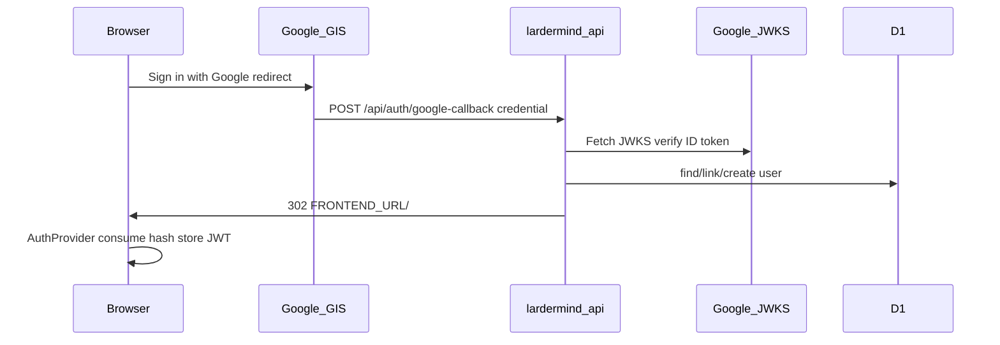

# Technical Design: Web Google login

**Feature reference:** [web-google-login.md](../features/web-google-login.md)  
**Status:** Implemented  
**Scope:** `backend-cf/` Google verify + routes; frontend env only  
**Out of scope:** Mobile Google, Nest

---

## 1. Architecture



Alternate path: SPA `POST /api/auth/google-login` `{ token }` → JSON `{ token, user }` (same verify + upsert). Primary web UX is **redirect callback**.

### 1.1 Design decisions

| # | Topic | Decision | Rationale |
|---|--------|----------|-----------|
| 1 | Verify | `jose` `createRemoteJWKSet` + `jwtVerify` | Already depended; Workers-friendly |
| 2 | Audience | `env.GOOGLE_CLIENT_ID` | Matches GIS Web client |
| 3 | Issuers | `https://accounts.google.com`, `accounts.google.com` | Google ID token spec |
| 4 | `FRONTEND_URL` | Required for callback; no trailing slash | Exact redirect target |
| 5 | Password for Google-only users | Random 32-byte hex + salt/HMAC | Matches Nest/Spring pattern; unused for Google sign-in |
| 6 | CORS on callback | Full-page form POST; no XHR CORS needed | Still return 302 without relying on ACAO |
| 7 | Picture | Store `picture` claim when present | Column already exists |
| 8 | Name split | `given_name` / `family_name` or split `name` | Fill `first_name` / `last_name` / `name` |

### 1.2 Repo touchpoints

```
backend-cf/
├── wrangler.toml                 # FRONTEND_URL, GOOGLE_CLIENT_ID vars
├── src/
│   ├── env.ts                    # FRONTEND_URL required-ish
│   ├── db/users.ts               # findByGoogleId, upsertGoogleUser
│   ├── lib/google-id-token.ts    # verifyGoogleIdToken
│   ├── lib/base64url.ts          # encode UTF-8 JSON
│   └── routes/auth.ts            # google-login + google-callback
└── README.md

frontend/                         # separate remote — env only
├── .env                          # VITE_GOOGLE_CLIENT_ID
└── .env.example                  # document production API
```

---

## 2. Data model

No new migration. Use existing `users.google_id`, `users.picture`.

| Field | Source |
|-------|--------|
| `google_id` | ID token `sub` |
| `email` | `email` |
| `picture` | `picture` (optional) |
| `first_name` / `last_name` / `name` | `given_name` / `family_name` / `name` |

Index: optional `CREATE INDEX` on `google_id` — skip in v1 unless lookups are slow (UUID-sized table).

---

## 3. API

Envelope: existing `ok` / `fail`.

### 3.1 `POST /api/auth/google-login`

| Item | Detail |
|------|--------|
| Body | JSON `{ token: string }` (Google ID token) |
| Success **200** | `data: { token, user }` — `user` = `toAuthUserDto` |
| Errors | **400** missing/invalid/unverified; **500** misconfigured env |

### 3.2 `POST /api/auth/google-callback`

| Item | Detail |
|------|--------|
| Body | `application/x-www-form-urlencoded` field **`credential`** |
| Success | **302** `Location: {FRONTEND_URL}/#google_auth={payload}` |
| Failure | **302** `Location: {FRONTEND_URL}/#google_auth_error={encodeURIComponent(msg)}` |

Payload encoding:

1. `JSON.stringify({ token, user })`
2. UTF-8 bytes → binary string → `btoa` → Base64URL (replace `+/`, strip `=`)

### 3.3 Core signatures

```typescript
verifyGoogleIdToken(idToken: string, clientId: string): Promise<{
  sub: string;
  email: string;
  email_verified: boolean;
  name?: string;
  given_name?: string;
  family_name?: string;
  picture?: string;
}>;

upsertGoogleUser(env: Env, profile: GoogleProfile): Promise<UserRow>;

encodeBase64UrlJson(value: unknown): string;
```

---

## 4. Business logic

1. Reject if token missing or not three JWT segments.
2. `jwtVerify` with remote JWKS; check `email_verified === true` (boolean or string `"true"`).
3. `findUserByGoogleId(sub)` → return.
4. Else `findUserByEmail(email)` → `UPDATE google_id, picture, updated_at` → return.
5. Else `INSERT` user + `usage_quotas` (same batch pattern as `createUser`).
6. `issueToken` → respond.

Missing `GOOGLE_CLIENT_ID`: fail with clear message.  
Missing `FRONTEND_URL` on callback: 500 JSON (cannot redirect safely).

---

## 5. Config

| Var | Example |
|-----|---------|
| `GOOGLE_CLIENT_ID` | `603047692060-llk1cjf1b0f5bpdb9it5cvogk2b8haio.apps.googleusercontent.com` |
| `FRONTEND_URL` | `https://lardermind.com` |
| Frontend `VITE_GOOGLE_CLIENT_ID` | same Client ID |
| Frontend `VITE_API_BASE_URL` (prod) | `https://api.lardermind.com` |

Local `FRONTEND_URL` for `wrangler.dev`: may use `http://localhost:5173` when testing redirect locally (operator sets via `.dev.vars` or override).

---

## 6. Risks

| Risk | Mitigation |
|------|------------|
| JWKS fetch latency / cold start | `jose` caches JWK set; accept first-hit cost |
| Wrong Client ID vs GIS | Same ID in frontend + Worker |
| Redirect URI mismatch | Document exact `…/api/auth/google-callback` |
| Email collision abuse | Only link when Google asserts `email_verified` |

---

## 7. Test plan

- Unit: Base64URL round-trip with non-ASCII.
- Unit: reject non-JWT token shape before JWKS.
- Unit/integration: upsert link-by-email vs create (D1 mock or local).
- Manual: production GIS button → land logged in on `lardermind.com`.
