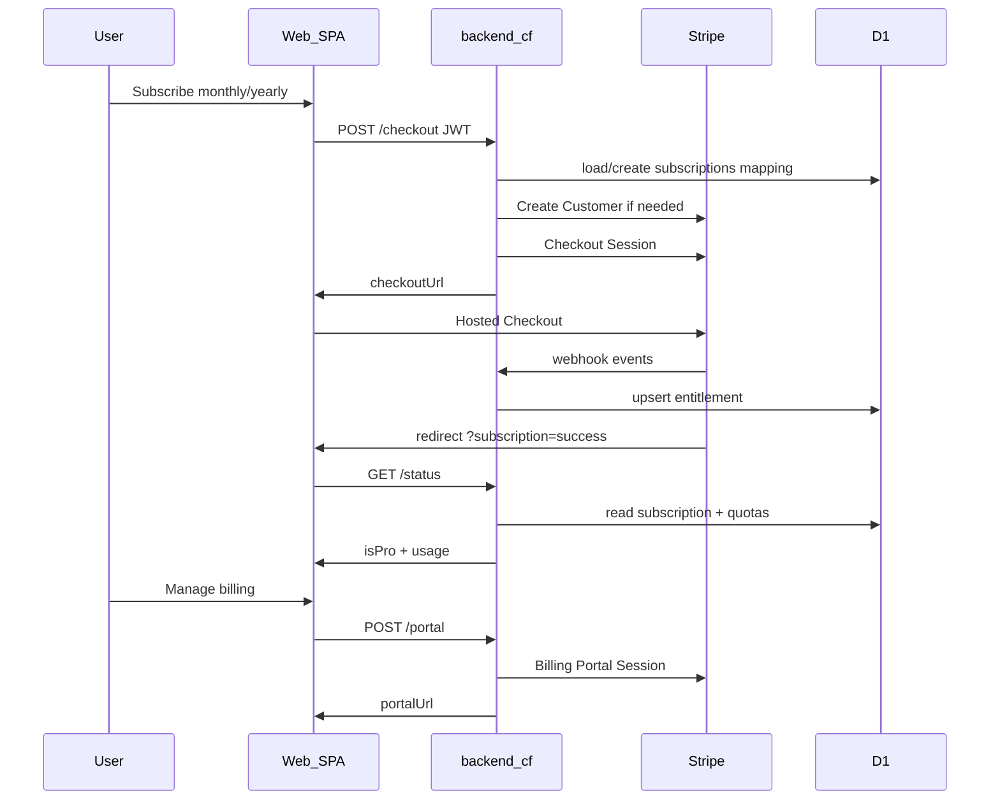

# Technical Design: Web Stripe subscription

**Feature reference:** [web-stripe-subscription.md](../features/web-stripe-subscription.md)  
**Status:** Implemented — enable with Stripe env; live cutover after smoke  
**Scope:** `backend-cf/` Stripe Checkout + Portal + webhooks + D1 entitlement; frontend manage button + minor API; legal copy  
**Out of scope:** Mobile IAP, Nest, Stripe Elements

---

## 1. Architecture



### 1.1 Design decisions

| # | Topic | Decision | Rationale |
|---|--------|----------|-----------|
| 1 | Stripe SDK | Official `stripe` package with Workers-compatible fetch HTTP client | Maintained API; avoid hand-rolled signing mistakes for Checkout; webhook still needs raw body |
| 2 | Entitlement | D1 `subscriptions` table keyed by `user_id` | Fast `isPro` without calling Stripe on every request |
| 3 | Webhook events | Listed in §3.5 | Covers checkout, lifecycle, invoices |
| 4 | Idempotency | Table `stripe_webhook_events` (`event_id` PK) | Stripe retries |
| 5 | Trial | Checkout `subscription_data.trial_period_days = 7` if no prior real subscription | Matches product `trialDays` |
| 6 | Already subscribed | `POST /checkout` → `409 ALREADY_SUBSCRIBED` + `portalUrl`; SPA redirects to Portal | Avoid duplicate subscriptions |
| 7 | Success URL trust | Banner only; Pro from webhook | Prevent free Pro via query param |
| 8 | AI quota period | UTC calendar day reset (mirror image UTC month helper) | Aligns with `aiMessagesPerDay` naming |
| 9 | Android product IDs in plans | Align to `com.lardermind.pro.monthly\|yearly` | Match store-launch-todo / mobile |
| 10 | Recipe hard caps | Deferred | Limit scope |
| 11 | Forward compat | `subscriptions.source` default `stripe` | Later Play / App Store writers |

### 1.2 Repo touchpoints

```
backend-cf/
├── migrations/0006_subscriptions.sql
├── wrangler.toml
├── .dev.vars.example
├── package.json
├── src/
│   ├── env.ts
│   ├── db/subscriptions.ts
│   ├── db/quotas.ts
│   ├── lib/stripe.ts
│   ├── lib/entitlement.ts
│   ├── routes/subscription.ts
│   ├── routes/upload.ts
│   ├── routes/pantry-vision.ts
│   ├── db/chat.ts / agent loop (AI quota)
│   └── index.ts
└── README.md

frontend/
├── src/api/subscription.ts
├── src/components/UpgradeButtons.tsx
├── src/components/SubscriptionPanel.tsx
└── src/App.tsx

docs/legal/
```

---

## 2. Data model

### 2.1 Migration `0006_subscriptions.sql`

```sql
CREATE TABLE subscriptions (
  user_id TEXT PRIMARY KEY REFERENCES users(id) ON DELETE CASCADE,
  stripe_customer_id TEXT NOT NULL,
  stripe_subscription_id TEXT,
  stripe_price_id TEXT,
  status TEXT NOT NULL DEFAULT 'none',
  -- none | incomplete | incomplete_expired | trialing | active |
  -- past_due | canceled | unpaid | paused
  cancel_at_period_end INTEGER NOT NULL DEFAULT 0,
  current_period_start INTEGER,
  current_period_end INTEGER,
  trial_end INTEGER,
  billing_period TEXT,
  source TEXT NOT NULL DEFAULT 'stripe',
  created_at INTEGER NOT NULL,
  updated_at INTEGER NOT NULL
);

CREATE UNIQUE INDEX idx_subscriptions_stripe_customer
  ON subscriptions(stripe_customer_id);

CREATE UNIQUE INDEX idx_subscriptions_stripe_subscription
  ON subscriptions(stripe_subscription_id)
  WHERE stripe_subscription_id IS NOT NULL;

CREATE TABLE stripe_webhook_events (
  event_id TEXT PRIMARY KEY,
  type TEXT NOT NULL,
  processed_at INTEGER NOT NULL
);
```

### 2.2 Entitlement helper

```ts
function isEntitled(status: string): boolean {
  return status === 'active' || status === 'trialing' || status === 'past_due';
}
```

`resolveEntitlement(db, userId)` → `{ isPro, isTrial, isAdmin, status, … }`  
Admin: unlimited quotas without requiring Stripe.

### 2.3 Status API mapping

| Field | Source |
|-------|--------|
| `isPro` | `isEntitled(status)` |
| `isTrial` | `status === 'trialing'` |
| `trialEndsAt` | `trial_end` |
| `expiresAt` | `current_period_end` |
| `planName` | from `billing_period` |
| `usage.*` | `usage_quotas` + tier limits |

---

## 3. API

Envelope: existing `ok` / `fail`.

### 3.1 `GET /api/subscription/plans` (public)

Unchanged shape.  
`stripeCheckoutEnabled =` all of `STRIPE_SECRET_KEY`, `STRIPE_WEBHOOK_SECRET`, `STRIPE_PRICE_MONTHLY`, `STRIPE_PRICE_YEARLY` present.  
Fix Android product IDs to `com.lardermind.pro.*`.

### 3.2 `GET /api/subscription/status` (auth)

Real entitlement + usage (AI daily + image monthly). Recipe fields may stay advertised-limits / zero used until a later feature.

### 3.3 `POST /api/subscription/checkout` (auth)

**Body:** `{ billingPeriod: 'monthly' | 'yearly' }`

1. If not configured → `503 STRIPE_NOT_CONFIGURED`
2. If entitled → `409 ALREADY_SUBSCRIBED` + `{ portalUrl }`
3. Ensure Stripe Customer (`email`, `metadata.userId`); upsert D1 row
4. Checkout Session:
   - `mode: 'subscription'`
   - price from env by `billingPeriod`
   - `client_reference_id` + metadata `userId`
   - `trial_period_days: 7` only if user never had `stripe_subscription_id` set
   - `success_url` / `cancel_url` from `FRONTEND_URL` + `?subscription=success|cancelled`
5. Return `{ checkoutUrl }`

### 3.4 `POST /api/subscription/portal` (auth)

Require `stripe_customer_id`; else `400 NO_CUSTOMER`.  
`return_url: ${FRONTEND_URL}/?subscription=portal_return`  
Return `{ portalUrl }`.

### 3.5 `POST /api/subscription/webhook` (public)

1. Raw body + `Stripe-Signature` verify with `STRIPE_WEBHOOK_SECRET`
2. If `event.id` already processed → `200`
3. Handle:

| Event | Action |
|-------|--------|
| `checkout.session.completed` | If subscription mode, retrieve Subscription → upsert |
| `customer.subscription.created` | Upsert |
| `customer.subscription.updated` | Upsert |
| `customer.subscription.deleted` | Mark canceled / not entitled; keep customer id |
| `invoice.paid` | Retrieve subscription → upsert period |
| `invoice.payment_failed` | Retrieve subscription → upsert status |

4. Resolve `userId` from subscription metadata → customer metadata → D1 by customer id  
5. Insert idempotency row; return `200`

Webhook route must use `c.req.text()` (raw), not pre-parsed JSON middleware.

### 3.6 Upsert mapping

| Stripe Subscription | D1 |
|---------------------|-----|
| `id` | `stripe_subscription_id` |
| `customer` | `stripe_customer_id` |
| `status` | `status` |
| `items.data[0].price.id` | `stripe_price_id` + `billing_period` |
| `cancel_at_period_end` | int 0/1 |
| `current_period_start/end` | unix |
| `trial_end` | unix |

---

## 4. Business logic

### 4.1 Config gate

```ts
function stripeConfigured(env: Env): boolean {
  return Boolean(
    env.STRIPE_SECRET_KEY &&
      env.STRIPE_WEBHOOK_SECRET &&
      env.STRIPE_PRICE_MONTHLY &&
      env.STRIPE_PRICE_YEARLY &&
      env.FRONTEND_URL,
  );
}
```

### 4.2 AI daily quota

`checkAndIncrementAiMessage(db, userId, { isPro, isAdmin })`:

- Free 20 / Pro 200 / admin unlimited per UTC day  
- Use `ai_message_sent` + `ai_period_start`  
- Replace increment-only path in agent/chat

### 4.3 Image quota

Pass real `isPro` from `resolveEntitlement` into upload + pantry-vision.

### 4.4 Frontend

- Add `createPortal()`
- `SubscriptionPanel`: **Manage billing** when customer exists / entitled; **Upgrade** when `!isPro`
- Handle `409` → redirect `portalUrl`
- Optional: `App.tsx` opens Subscription on `portal_return`

---

## 5. Config / secrets

| Name | Kind | Purpose |
|------|------|---------|
| `STRIPE_SECRET_KEY` | secret | API |
| `STRIPE_WEBHOOK_SECRET` | secret | `whsec_…` |
| `STRIPE_PRICE_MONTHLY` | var | `price_…` |
| `STRIPE_PRICE_YEARLY` | var | `price_…` |
| `FRONTEND_URL` | var (exists) | return URLs |

Local: `stripe listen --forward-to localhost:8787/api/subscription/webhook`.

---

## 6. Edge cases & errors

| Case | Behavior |
|------|----------|
| Missing env | flag false; checkout/portal 503 |
| Invalid `billingPeriod` | 400 |
| Stripe API error | 502 safe message |
| Bad webhook signature | 400 |
| Webhook user unknown | Log + 200 (avoid retry storms) |
| User deleted | FK cascade |

---

## 7. Performance & security

- Hot paths use D1 only (no Stripe per chat/upload)
- Signature verification required
- Return URLs only from `FRONTEND_URL`
- Client never chooses Price ID (only `billingPeriod`)

---

## 8. Testing plan

| Test | Type |
|------|------|
| `isEntitled` matrix | unit |
| AI day rollover + limits | unit |
| Webhook bad signature | route |
| Webhook idempotency | route |
| Price map monthly/yearly | unit |
| Manual Checkout + CLI | E2E |

---

## 9. Risks

| Risk | Mitigation |
|------|------------|
| Success before webhook | Banner + refresh |
| Portal Dashboard misconfig | Ops checklist task |
| Trial abuse via new accounts | Accept v1 |
| Legal lag | Go-live blocked on legal task |
| Dual billing later | `source` column |

---

## 10. Rollout

1. Test keys + Stripe CLI locally  
2. Deploy Worker test mode + Dashboard webhook  
3. Ship legal pages  
4. Live keys / webhook / prices  
5. Smoke scenarios S1–S3, S7–S9  

---

## 11. References

- Feature: [web-stripe-subscription.md](../features/web-stripe-subscription.md)
- Tasks: [tasks/web-stripe-subscription/](../../tasks/web-stripe-subscription/)
